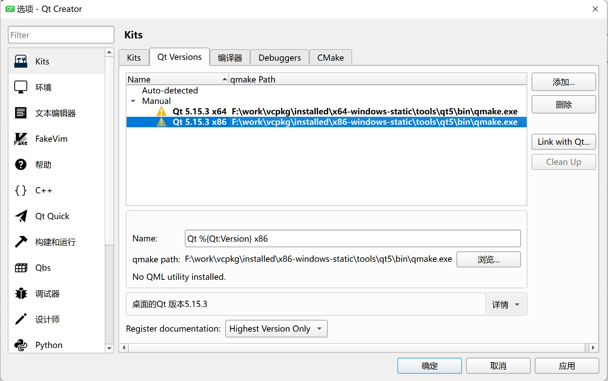
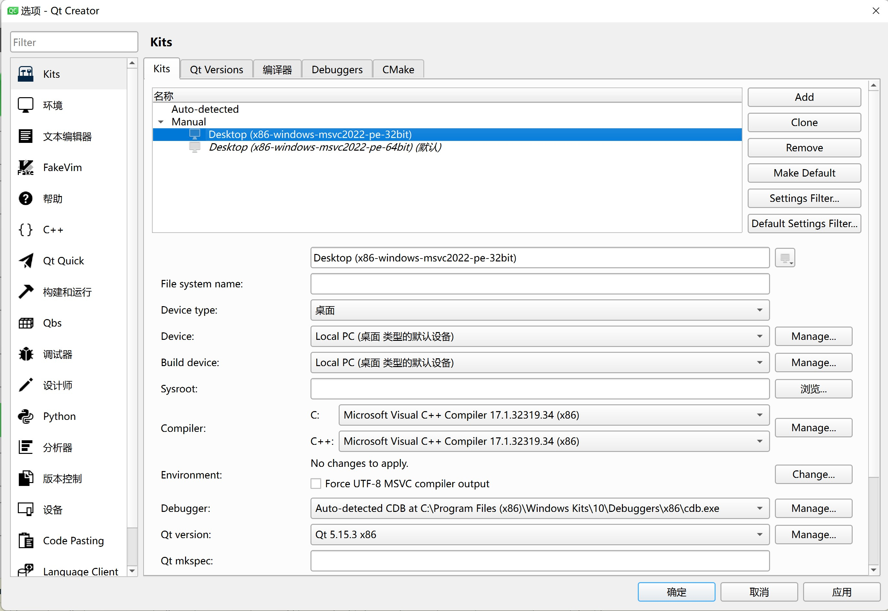
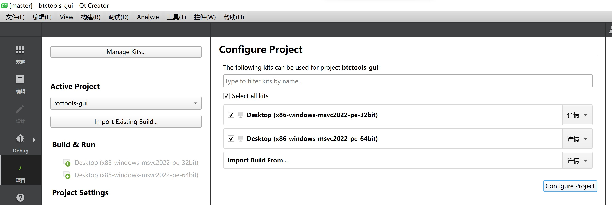
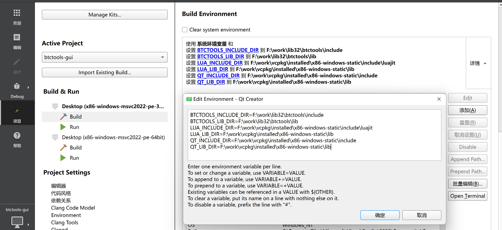

# BTC tools GUI

## Build

### Linux

See details: https://github.com/btccom/btctools-snap

### Windows

1. Compile and install [libbtctools](https://github.com/btccom/libbtctools), details：[libbtctools:README.md](https://github.com/btccom/libbtctools/blob/master/README.md#build-on-windows)

2. Compile and install qt and libcurl (the vcpkg command used was already installed in the first step):

  ```bash
  cd vcpkg

  # 32-bit
  .\vcpkg install qt5:x86-windows-static curl:x86-windows-static

  # 64-bit
  .\vcpkg install qt5:x64-windows-static curl:x64-windows-static
  ```

3. Install Qt Creator, the installation package can be downloaded here: https://download.qt.io/official_releases/qtcreator/

  After installation, open Qt Creator > Tools > Options > Kits, click "Add", add the following **qmake.exe** to it, and then click "Apply":

  - `F:\work\vcpkg\installed\x86-windows-static\tools\qt5\bin\qmake.exe`

      Fill in the **Name** input box: `Qt %{Qt:Version} x86`

  - `F:\work\vcpkg\installed\x64-windows-static\tools\qt5\bin\qmake.exe`

      Fill in the **Name** input box: `Qt %{Qt:Version} x64`

  Replace `F:\work\vcpkg` with your `vcpkg` installation path.

  

4. Click the "Kits" tab next to "Qt Versions", and then click "Desktop (x86)" in "Manual", select "Qt version" as the x86 version of qt you just added. Desktop (x86......)", and select "Qt version" as the x86 version of qt you just added.

  Then select "Desktop (x64......)" and choose "Qt version" as the x64 version of qt you just added.

  

5. Clone this project in the parent directory of the "libbtctools" project and create a symbolic link to "libbtctools":

  ```bash
  git clone https://github.com/btccom/btctools-gui.git
  cd btctools-gui
  .\mklink.bat
  ```

6. Use Qt Creator to open "btctools-gui.pro" in this project, then check the desired "Kits", and then click "Configure Project and click "Configure Project".

  

7. Click "Project" on the left side of Qt Creator, then click "Build" for 32-bit Kit in "Build & Run", then scroll to the "Build Environment" section. "Build Environment" section, click "Details" to expand the environment variable editor, click "Bulk Edit" button on the right side, fill in the following content (Modify `F:\work` to your actual installation path):

  ```bash
  BTCTOOLS_INCLUDE_DIR=F:\work\lib32\btctools\include
  BTCTOOLS_LIB_DIR=F:\work\lib32\btctools\lib
  LUA_INCLUDE_DIR=F:\work\vcpkg\installed\x86-windows-static\include\luajit
  LUA_LIB_DIR=F:\work\vcpkg\installed\x86-windows-static\lib
  QT_INCLUDE_DIR=F:\work\vcpkg\installed\x86-windows-static\include
  QT_LIB_DIR=F:\work\vcpkg\installed\x86-windows-static\lib
  ```

  If it is a 64-bit Kit, fill in the following:

  ```bash
  BTCTOOLS_INCLUDE_DIR=F:\work\lib64\btctools\include
  BTCTOOLS_LIB_DIR=F:\work\lib64\btctools\lib
  LUA_INCLUDE_DIR=F:\work\vcpkg\installed\x64-windows-static\include\luajit
  LUA_LIB_DIR=F:\work\vcpkg\installed\x64-windows-static\lib
  QT_INCLUDE_DIR=F:\work\vcpkg\installed\x64-windows-static\include
  QT_LIB_DIR=F:\work\vcpkg\installed\x64-windows-static\lib
  ```

   

8. Trying to compile the project for 32-bit and 64-bit Release. Since the libbtctools library only compiles the Release version, it cannot be Debug compiled.

9. If you are prompted that the header file or library file cannot be found, remember to delete the temporary compilation folder, which is in the same directory as btctools-gui, and the directory name is like "build-btctools-gui-Desktop_x86_windows_msvc2022_pe_32bit-Release". The compiled exe is also located here.
